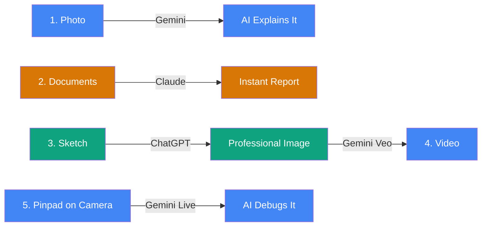
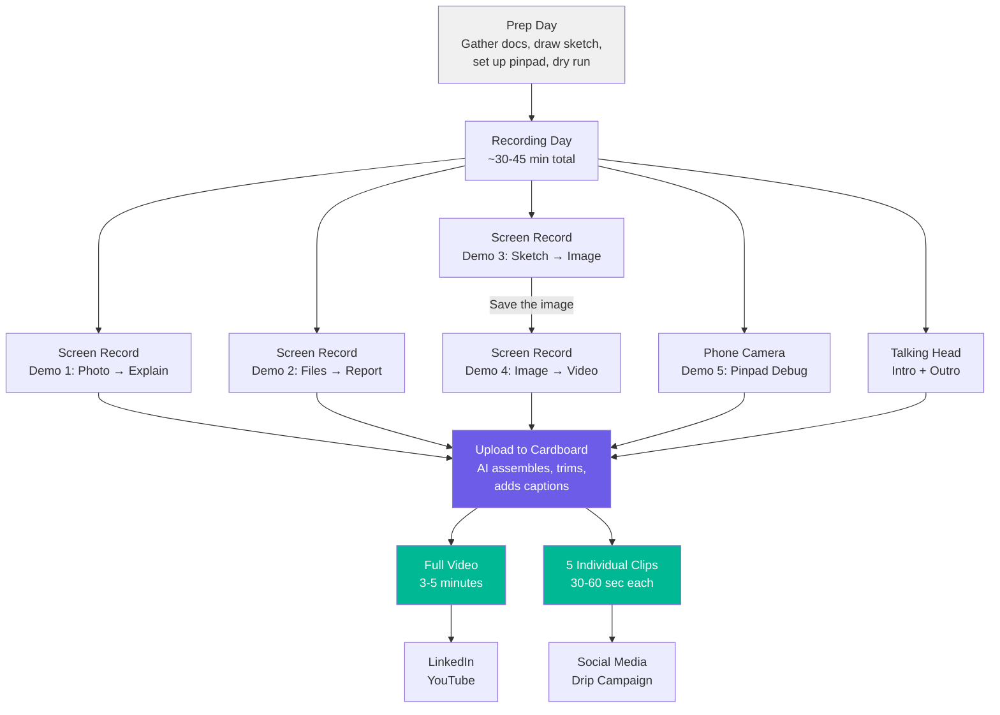
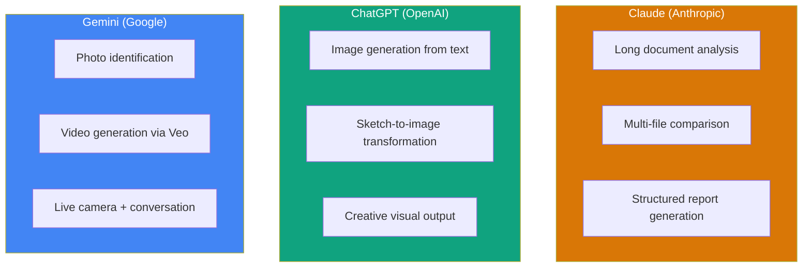

# 5 Things You Didn't Know AI Can Do

**A bite-size video project by Ed Crotty, Claude Certified Architect at Datacap Systems, Inc.**

---

## What Is This?

This is the complete behind-the-scenes plan for a short video (3-5 minutes) where I demonstrate five AI capabilities that most people have no idea exist today. Not in some distant future — right now.

The twist? **This entire project — the strategy, the script, the production plan, the social media rollout — was designed collaboratively with AI.** You're looking at the output of that collaboration. The video itself will also be edited by AI using a tool called [Cardboard](https://www.usecardboard.com/).

So really, it's a demonstration of AI capabilities all the way down.

---

## The 5 Demos at a Glance

Each demo uses a different AI platform to show the breadth of what's available today.

| # | What I'm Doing | AI Platform | Why It's Impressive |
|---|---------------|-------------|-------------------|
| 1 | Taking a photo of something and asking AI to explain it | **Gemini** | Instant identification — no Googling, no manuals |
| 2 | Uploading multiple documents at once and getting a full analysis | **Claude** | An hour of work done in 10 seconds |
| 3 | Drawing stick figures on paper and having AI create a real image | **ChatGPT** | Napkin sketch becomes presentation-ready |
| 4 | Taking that image and turning it into a video | **Gemini Veo** | Paper drawing → image → video. Three steps. |
| 5 | Pointing a phone camera at a payment pinpad and debugging it live | **Gemini Live** | AI sees your device and talks you through the fix in real-time |

> **Demo 5 is the showstopper.** Every retail tech professional has been on hold with support trying to describe what's on a pinpad screen. This demo replaces that entire experience.

---

## How the Video Gets Made

The production workflow is designed to be fast and modular — record each demo separately so if one needs a redo, you only redo that piece.

---

## What's in This Repository

Everything needed to execute this project lives here.

### [The Script (Talking Points)](script/talking-points.md)
A set of bullet points for each demo — not a word-for-word script, but enough structure to stay on track while talking naturally. Includes a recording checklist so nothing gets missed.

### [The Full Design Spec](docs/superpowers/specs/2026-03-27-rspa-ai-video-design.md)
The detailed plan covering video structure, timing for each segment, demo-by-demo technical specs, what to prep, retry protocol if something goes wrong, and a day-by-day timeline.

### [Cardboard Assembly Brief](cardboard/assembly-brief.md)
Ready-to-use prompts for [Cardboard](https://www.usecardboard.com/) (the AI video editor) that tell it exactly how to assemble the raw clips into a finished video. Includes tips from the Cardboard team on picture-in-picture overlays, search-by-content, and pacing.

### Asset Folders
- **`assets/sketch/`** — Photos of the hand-drawn sketch (input for Demo 3)
- **`assets/docs-for-upload/`** — The documents used in Demo 2
- **`assets/outputs/`** — AI-generated images and videos from the demos
- **`recordings/raw/`** — Raw screen recordings and phone clips
- **`final/`** — The finished video and individual clips

---

## The AI Platforms Used

This project deliberately showcases three different AI platforms to demonstrate that **AI is not one tool — each platform has different strengths.**

Knowing which tool to use for which job is the real skill — and that's one of the key messages of this video.

---

## Timeline

| Phase | What Happens |
|-------|-------------|
| **Day 1 — Prep** | Gather documents, draw the sketch, set up the pinpad, do a dry run of the live camera demo |
| **Day 2 — Record** | Record all 5 demos + talking head intro/outro (~30-45 min total) |
| **Day 2-3 — Edit** | Upload everything to Cardboard, review the AI-edited result, request tweaks |
| **Day 3-4 — Finalize** | Export the full video + 5 individual clips |
| **Day 4-5 — Publish** | Post to LinkedIn, YouTube, share with RSPA |

---

## Why This Matters for Retail Technology

The retail technology channel is at an inflection point with AI. Most VARs, ISVs, and partners have heard the buzz — but many haven't seen what AI can actually do with their own eyes.

This video is designed to change that in under 5 minutes. Each demo was chosen to be:

- **Immediately understandable** — no technical jargon, no setup needed
- **Directly relevant** — document analysis, visual mockups, and live device debugging are things this audience does every day
- **Surprising** — even people who use AI regularly don't know about many of these capabilities

The pinpad debugging demo in particular speaks directly to a pain point every person in this industry knows: trying to troubleshoot a device over the phone. Showing AI doing that visually, in real-time, is the kind of moment that shifts perspectives.

---

## About

**Ed Crotty** is a Claude Certified Architect at [Datacap Systems, Inc.](https://www.datacapsystems.com/) He is an active contributor to the [RSPA](https://www.gorspa.org/) (Retail Solutions Providers Association), including authoring content on [AI misconceptions and best practices](https://www.gorspa.org/ai-misconceptions-best-practices/).

This project was designed collaboratively with Claude (Anthropic's AI) using [Claude Code](https://claude.ai/code), demonstrating that AI is not just a tool for the final product — it's a tool for the entire creative process, from brainstorming to planning to production.

---

*Built with AI. About AI. Edited by AI.*
